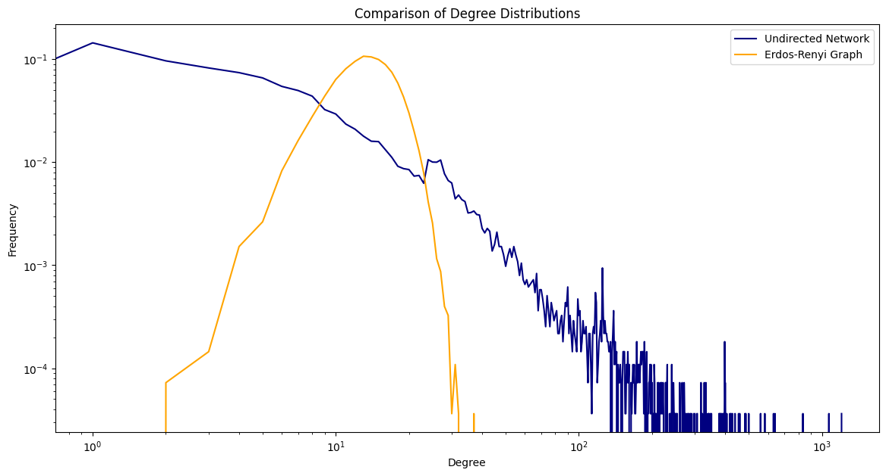
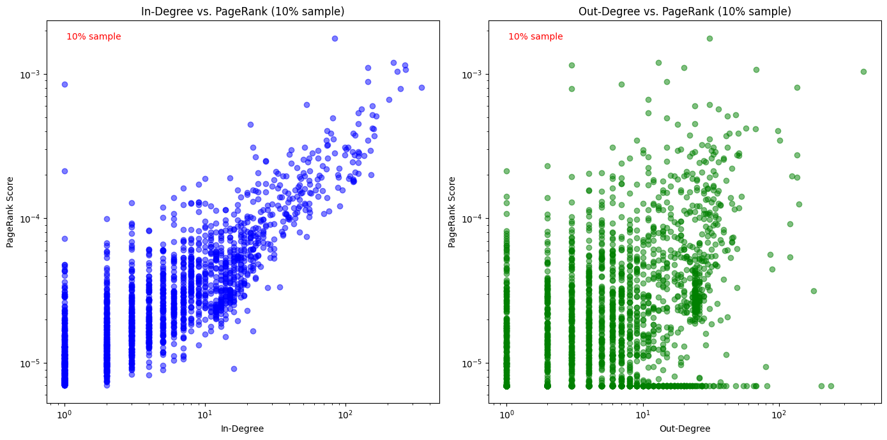
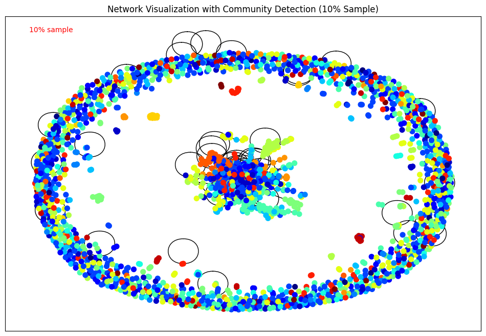
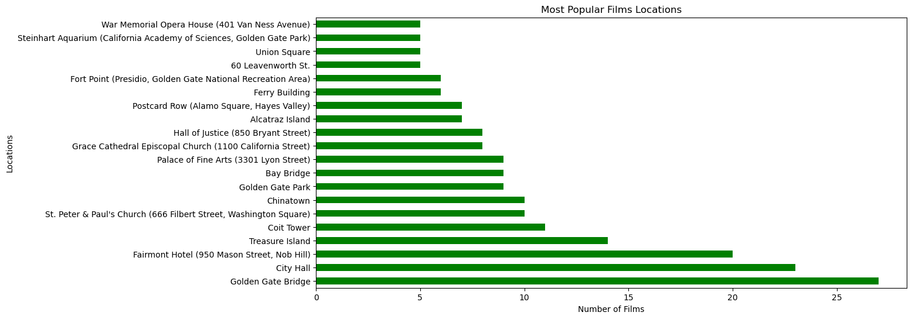

# Big Data Mining

Three questions asked of data too big for a spreadsheet, answered with **Python**, **SQL on Google BigQuery** and the **Unix shell**.

1. **What holds Wikipedia together?** Network analysis of the full English Wikipedia link graph.
2. **What happens in San Francisco, and when?** SQL on the city's public film, police and fire-department data.
3. **How do JavaScript and Python developers use Stack Overflow?** SQL on millions of posts, plus Unix processing on a computing cluster.



*How many links each Wikipedia page has (blue), compared with a random network of exactly the same size and number of links (orange). In the random network almost every page has around the same number of links. Real Wikipedia has a long tail: most pages have only a few links, while a handful of hub pages have hundreds or more.*

## 1. What holds Wikipedia together?

The English Wikipedia of March 2002 as a network: every page is a node and every link is an edge.

- **A few hubs carry the network.** Most pages have only a handful of links, but the most-linked pages are pointed to by over a thousand others. A random network with the same number of pages and links never produces hubs like these (chart above).
- **Importance comes from incoming links.** A page's PageRank rises with the number of pages linking *to* it, but has almost nothing to do with how many pages it links *out* to.
- **Topic matters.** Topic-specific PageRank shows that "sports" pages concentrate around a few strong clusters, while "history" pages spread across many geographic topics.
- **Wikipedia falls into natural communities.** Community detection finds **86 communities** with a modularity of **0.63**, a strong structure. The most frequent words in each reveal its theme, such as war and politics, or science and energy.

| PageRank vs. incoming and outgoing links | Communities in the network (10% sample) |
|:---:|:---:|
|  |  |

[Notebook with all code and results](1-wikipedia-network/wikipedia_network.ipynb) · [Code as a Python script](1-wikipedia-network/wikipedia_network.py)

## 2. What happens in San Francisco, and when?

SQL queries on BigQuery's public San Francisco tables, with the results loaded into pandas and plotted.

- **San Francisco on screen:** 2015 was the busiest year for filming in the city (23 films), and the Golden Gate Bridge is the most filmed location.
- **Police incidents:** larceny/theft is the most common incident on every single day of the week.
- **Fire department calls:** medical incidents are the most common call every day. The fire department receives roughly twice as many calls as there are police incidents, and both are busiest at the end of the week.

<p align="center"></p>

[Notebook with all code and results](2-san-francisco-sql/san_francisco_bigquery.ipynb) · [Code as a Python script](2-san-francisco-sql/san_francisco_bigquery.py)

## 3. How do JavaScript and Python developers use Stack Overflow?

SQL on BigQuery's public Stack Overflow dataset, then Unix tools on an export of questions that involve both JavaScript and Python.

- **JavaScript vs. Java:** JavaScript has more questions (2.4M vs. 1.9M), but Java questions get slightly more views, answers and votes on average.
- **Weekly rhythm:** Wednesday is the busiest day for questions and Saturday the quietest. More-viewed questions generally score higher.
- **Text processing at the command line:** cleaning a CSV with quoted commas using `awk` and `sed`, counting pandas and NumPy mentions, and splitting 15 years of posts (2008-2022) into one file per year.
- **Compression on a cluster:** a Slurm batch job shows that gzip compresses a file made of 10 *sorted* copies of the data far better (5 MB) than 10 unsorted copies (34 MB), because sorting puts repeated rows next to each other.

[SQL queries](3-stackoverflow-javascript-vs-python/stackoverflow_queries.sql) · [Shell commands](3-stackoverflow-javascript-vs-python/unix_commands.sh) · [Slurm job](3-stackoverflow-javascript-vs-python/duplicate_and_zip.sh) · Results: [SQL](3-stackoverflow-javascript-vs-python/sql_results.txt), [Unix](3-stackoverflow-javascript-vs-python/unix_results.txt)

## Tools

Python · SQL · Google BigQuery · NetworkX · pandas · Matplotlib · Google Colab · Unix shell (awk, sed, grep) · Slurm

## Running it

The notebooks are saved **with all their outputs**, so every result and chart can be read on GitHub without running anything. To run them yourself:

- **Wikipedia network:** Python with `networkx`, `pandas` and `matplotlib`. The notebook downloads the 2002 link graph from [Zenodo](https://zenodo.org/record/2539424) itself. It was run on Google Colab.
- **San Francisco:** a Google Cloud project with the BigQuery API enabled and the `google-cloud-bigquery` Python library. Authenticate with `gcloud auth application-default login`, then set your project ID in the notebook. All the queries use free public datasets.
- **Stack Overflow:** the SQL runs directly in the BigQuery console. The shell commands run on any Linux machine, and the batch job is submitted with Slurm (`sbatch duplicate_and_zip.sh`). They work on a CSV of about 4,900 Stack Overflow questions and answers involving JavaScript and Python. That file isn't included here, because one of the public posts in it contains a stranger's leaked access key. A similar file can be exported from BigQuery and saved as `3-stackoverflow-javascript-vs-python/data/stackoverflow_javascript_python_qa.csv`:

  ```sql
  SELECT q.tags, q.title, q.id AS question_id, q.creation_date AS question_date, q.body AS question_body,
         a.id AS answer_id, a.creation_date AS answer_date, a.body AS answer_body
  FROM `bigquery-public-data.stackoverflow.posts_questions` q
  JOIN `bigquery-public-data.stackoverflow.posts_answers` a ON a.parent_id = q.id
  WHERE LOWER(q.tags) LIKE '%javascript%' AND LOWER(q.title || q.tags) LIKE '%python%'
  ORDER BY q.creation_date
  ```

## Background

Done in March-April 2024 as part of the *Big Data Mining* course at the Hebrew University of Jerusalem (B.Sc. Statistics & Data Science). The Stack Overflow project was done together by **Daniel Rodan and Ido Shalom**; the Wikipedia and San Francisco projects by Ido Shalom.
